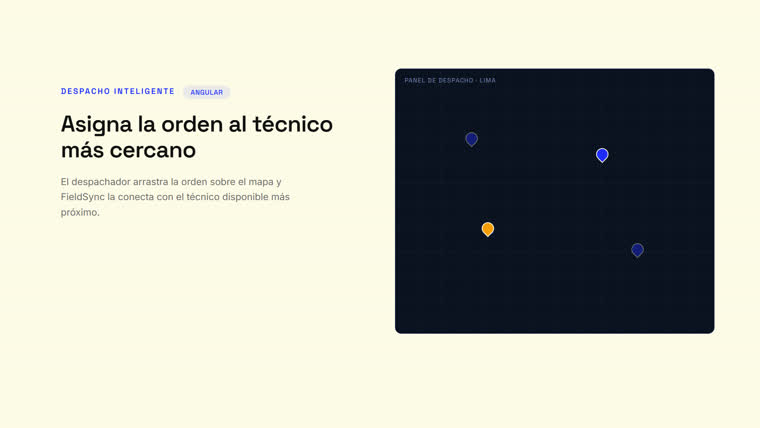
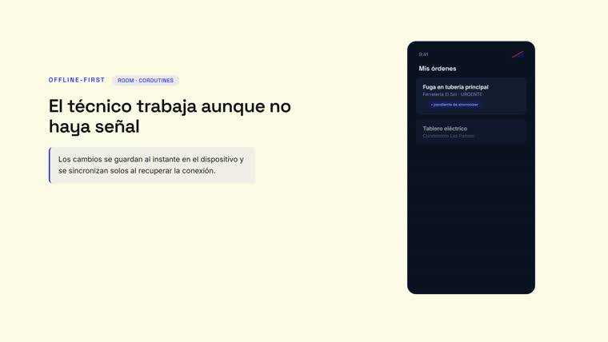
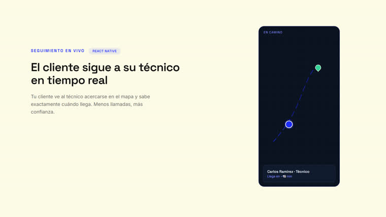
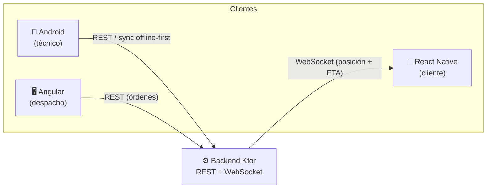
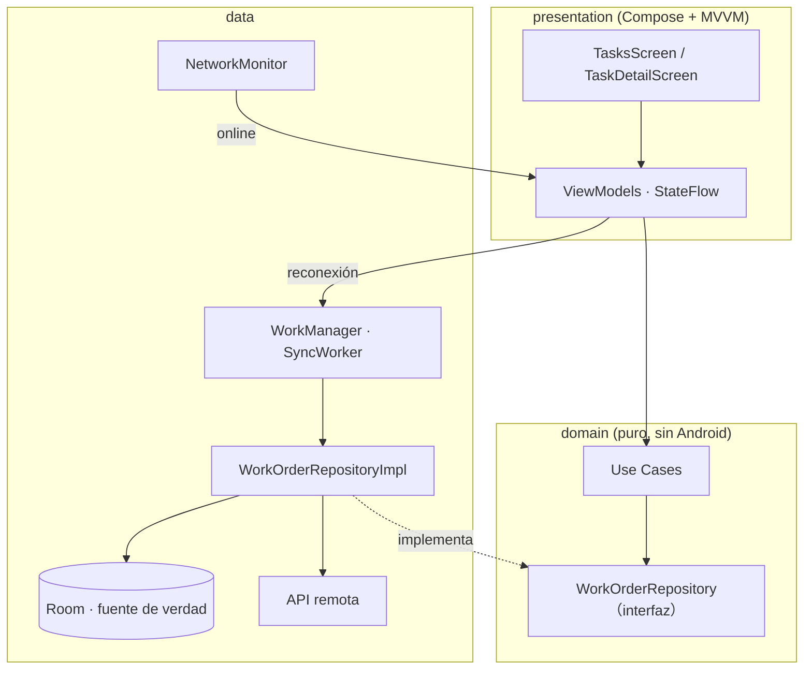
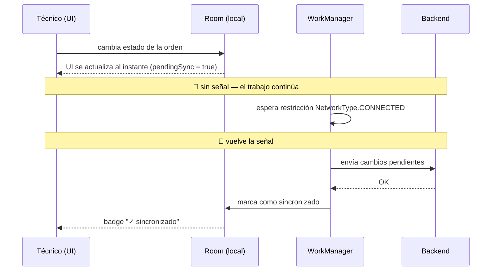

# FieldSync

**Software de gestión de tareas para técnicos de campo** — plomeros, electricistas e instaladores.
Conecta la oficina, al técnico en la calle y al cliente final en un solo flujo, **incluso sin señal**.

<p align="center">
  
  <br>
  <em>Video promocional (HyperFrames, HTML/CSS/GSAP) — UI del producto simulada · <a href="marketing/videos/fieldsync-promo/renders/video.mp4">ver MP4 1080p</a></em>
</p>


[](https://github.com/BRIAM13/fieldsync-saas/actions/workflows/ci.yml)
Repo: [github.com/BRIAM13/fieldsync-saas](https://github.com/BRIAM13/fieldsync-saas) · **Panel en vivo:** [fieldsync-web-admin.vercel.app](https://fieldsync-web-admin.vercel.app) (Vercel) · **Backend en vivo:** [fieldsync-backend-cipm.onrender.com](https://fieldsync-backend-cipm.onrender.com/health) (Render + Aiven Postgres) · Cuenta demo: `admin@fieldsync.dev` / `demo1234`

> **Sobre este repositorio.** FieldSync es la **pieza central del portafolio** de Briam Ronceros
> para postular a puestos de **Desarrollador Android**. Cada componente está elegido para
> demostrar, con código real, las competencias que piden las ofertas: Kotlin, Coroutines/Flow,
> MVVM, Clean Architecture, MVP (legacy), WorkManager, Angular y React Native.

---

## El ecosistema

Tres aplicaciones sobre un modelo de dominio común:

| Pieza | Usuario | Stack | Rol |
|-------|---------|-------|-----|
| [`android-app/`](android-app/) | Técnico en la calle | **Kotlin** · Clean Arch + MVVM · Compose · Room · WorkManager | Recibe, ejecuta y cierra órdenes **offline-first** |
| [`web-admin/`](web-admin/) | Despachador / admin | **Angular 18** · TypeScript · RxJS | Asigna tareas sobre un mapa |
| [`client-app/`](client-app/) | Cliente final | **React Native** (Expo) | Solicita un servicio (con GPS) y sigue a su técnico **en tiempo real** |
| [`backend/`](backend/) | — (API compartida) | **Ktor** · Kotlin · WebSockets | Conecta las tres apps: REST + tiempo real |
| [`marketing/`](marketing/) | — | **HyperFrames** (HTML/CSS/GSAP) | Video promocional → MP4 |

### Las 3 características clave (una por tecnología)

|  |  |  |
|:--:|:--:|:--:|
| **1. Asignación en mapas** · *Angular* | **2. Offline-first** · *Kotlin · Room + WorkManager* | **3. Tiempo real** · *React Native* |

<sub>Imágenes: fotogramas del video promocional (UI simulada). Para capturas de las apps reales, ver la [guía de captura](docs/CAPTURES.md).</sub>

### El ecosistema conectado



---

## Arquitectura

### App Android — Clean Architecture + MVVM



Las dependencias **apuntan hacia adentro**: `domain` no conoce Android, Room ni Compose,
por eso su lógica se testea sin instrumentación.

### Flujo offline-first



---

## Cómo cada tecnología destaca las competencias que piden los empleadores

| Tecnología | Dónde | Qué demuestra |
|------------|-------|---------------|
| **Kotlin** | `android-app` | Código idiomático moderno: data/sealed classes, null-safety, extensiones |
| **Coroutines & Flow** | data → domain → presentation | Asincronía estructurada, streams reactivos de Room a la UI |
| **MVVM + Clean Architecture** | `android-app` | Separación de capas, inversión de dependencias, testabilidad |
| **WorkManager** | `data/sync` | Sincronización real en 2.º plano con restricción de red + backoff |
| **Ktor (backend Kotlin)** | `backend` | Kotlin *end-to-end*: API REST + WebSockets con Coroutines |
| **PostgreSQL + Exposed** | `backend/db` | Persistencia real, DSL tipado, transacciones suspend; Docker + deploy |
| **JWT + multi-tenancy** | `backend/security` | Auth con BCrypt + JWT; datos aislados por empresa (tenant) en toda la API |
| **MVP (legacy)** | `history/` | Comprensión de arquitecturas heredadas y su migración a MVVM |
| **Jetpack Compose** | `presentation` | UI declarativa, estado unidireccional, Navigation Compose |
| **Angular + TypeScript** | `web-admin` | Routing lazy, servicios inyectables, tipado estricto |
| **Leaflet (mapas)** | `web-admin/map-dispatch` | Mapa interactivo real (OpenStreetMap), marcadores + asignación |
| **React Native** | `client-app` | Móvil multiplataforma; criterio nativo vs. cross-platform |

Detalle completo por fases en [`ROADMAP.md`](ROADMAP.md).

---

## Cómo ejecutar cada parte

> **Los tres clientes apuntan por defecto al backend en producción**
> ([fieldsync-backend-cipm.onrender.com](https://fieldsync-backend-cipm.onrender.com)) — corren
> tal cual, sin levantar nada más. Cuenta demo: **admin@fieldsync.dev / demo1234**. Para apuntar
> a un backend local en su lugar (`cd backend && gradle run`, `:8080`), cambia la URL base en
> `ApiConfig.kt` (Android), `api.config.ts` (Angular) o `config.ts` (React Native) — cada archivo
> trae la alternativa local comentada.

### Panel web (Angular) — lo más rápido de ver
```bash
cd web-admin
npm install
npm start          # → http://localhost:4200
```

### App Android (Kotlin)
Abrir `android-app/` en **Android Studio** (Giraffe+), sincronizar Gradle y ejecutar en un
emulador o dispositivo. Tests unitarios:
```bash
cd android-app
./gradlew testDebugUnitTest
```

### Backend (Ktor · Kotlin) — API compartida
Requiere JDK 17 o 21.
```bash
cd backend
gradle run         # → http://localhost:8080/health
gradle test        # tests de integración de la API
```
Contrato completo de endpoints en [`backend/README.md`](backend/README.md).

### App cliente (React Native)
```bash
cd client-app
npm install
npm start          # Expo
```

### Video promocional (HyperFrames)
Ya renderizado en [`marketing/videos/fieldsync-promo/renders/video.mp4`](marketing/videos/fieldsync-promo/) (23s, 1080p).
Para reconstruirlo: `cd marketing/videos/fieldsync-promo && npm run render`.

---

## Estado

Fase 1 (núcleo Android) y Fase 2/3 (scaffolds Angular/RN) completas, con el material de
marketing renderizado. Próximas fases (backend real, más pantallas) en el [ROADMAP](ROADMAP.md).
