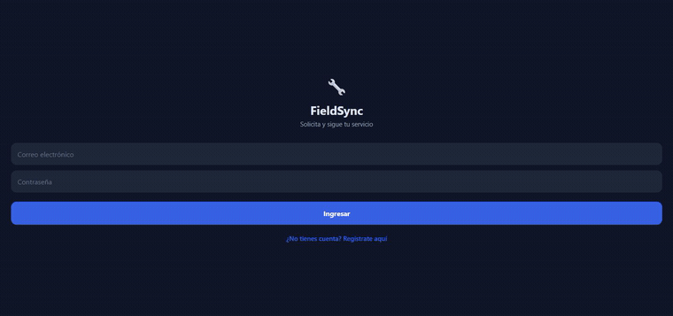

# FieldSync — App Cliente (React Native)

App móvil multiplataforma para el **cliente final**. Muestra el **seguimiento del técnico en tiempo real** (característica clave #3).

## Stack

- **React Native** (Expo) + **TypeScript**
- Hook `useTechnicianTracking` — abre un **WebSocket real** al backend Ktor
  (`ws://.../ws/tracking/{orderId}`) y actualiza la posición del técnico con cada mensaje

> **Requiere el backend corriendo** (`cd ../backend && gradle run`). La URL base está en
> `src/config.ts` (`10.0.2.2` para el emulador Android, `localhost` para iOS Simulator).

La pantalla se **autentica al montar** (`AuthService.login`) para obtener el JWT, y lo pasa al
WebSocket como query param (`?token=…`), que el backend exige antes de emitir posiciones.

## Por qué está en el portafolio

Demuestra **versatilidad móvil**: entiendo tanto el desarrollo **nativo** (la app de técnicos en Kotlin) como el **multiplataforma** (esta app en React Native), y sé argumentar cuándo conviene cada uno.

## Estructura

```
client-app/
├── App.tsx
└── src/
    ├── screens/    TrackingScreen.tsx   (UI de seguimiento en vivo)
    └── services/   TrackingService.ts   (hook del stream en tiempo real)
```

## Ejecutar

```bash
npm install
npm start        # expo start
```

## 📸 Capturas

Graba el seguimiento en vivo con el backend corriendo (ver la [guía de captura](../docs/CAPTURES.md))
y colócalo en `docs/media/`. Luego descomenta:

<!--  -->
