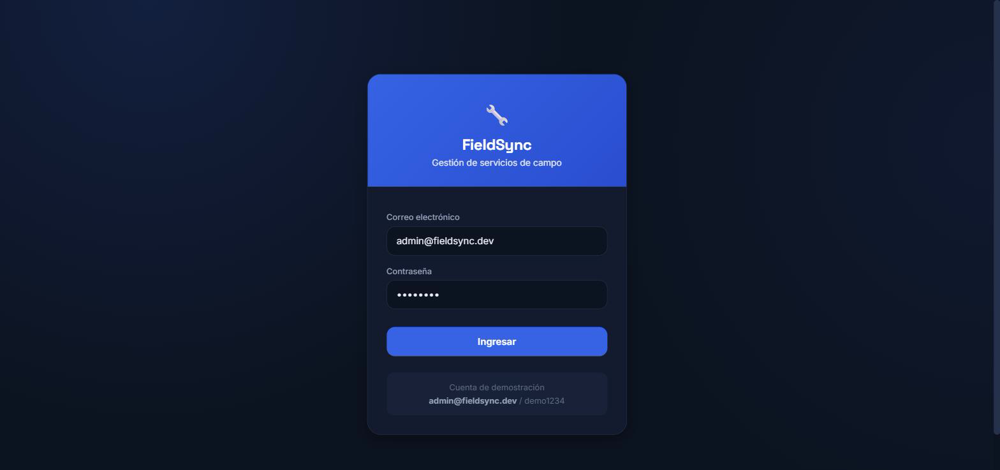
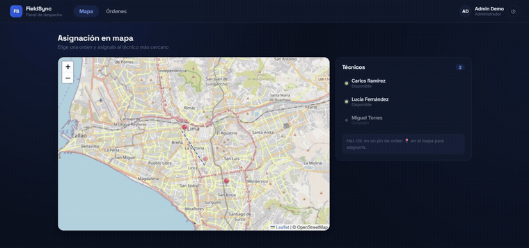

# FieldSync — Panel Web Admin (Angular)

Panel de despacho para el administrador/despachador. Asigna órdenes de trabajo a técnicos sobre un mapa.

**En vivo:** [fieldsync-web-admin.vercel.app](https://fieldsync-web-admin.vercel.app) (Vercel) — conectado al backend real en Render + Aiven Postgres.

## Stack

- **Angular 18** (componentes standalone) + **TypeScript** en modo estricto
- **Rutas** con carga diferida (lazy) por feature
- **RxJS** + **Signals** para estado reactivo
- **`HttpClient` conectado al backend real** (Ktor) — órdenes, técnicos, asignación y gestión de usuarios
- **Leaflet + OpenStreetMap** — mapa interactivo real con marcadores de órdenes y técnicos

> La URL base del backend está centralizada en `core/api.config.ts` y por defecto apunta a
> producción (Render + Aiven). Para desarrollo local contra un backend en tu máquina
> (`cd ../backend && gradle run`), cámbiala temporalmente a `http://localhost:8080`.

### Autenticación

- **Login** en `/login` (demo: `admin@fieldsync.dev` / `demo1234`) → `AuthService` guarda el
  access + refresh token en `localStorage` (la sesión sobrevive a recargas).
- Un **HTTP interceptor** adjunta el Bearer y, ante un **401**, renueva el token con `/auth/refresh`
  y reintenta la petición una vez; si el refresh falla, cierra la sesión.
- Un **guard** (`authGuard`) protege `/dispatch`, `/orders` y `/team`, y redirige a `/login` sin sesión.
- **RBAC en la UI**: el botón "Asignar" y la lista de técnicos solo aparecen para ADMIN/DISPATCHER
  (el backend lo exige igual). Prueba con `dispatcher@fieldsync.dev` vs `tech@fieldsync.dev` (`demo1234`).
- **Gestión de usuarios** (`/team`, solo ADMIN): lista y crea usuarios del tenant. Protegida por
  `adminGuard` en el cliente además del RBAC del backend (`GET`/`POST /api/users`).

## Estructura

```
src/app/
├── core/
│   ├── guards/    authGuard, adminGuard
│   ├── models/    auth.model.ts, work-order.model.ts (tipos compartidos)
│   └── services/  auth.service.ts, user-management.service.ts, work-order.service.ts
├── features/
│   ├── map-dispatch/   mapa Leaflet + asignación inteligente  ← característica clave #1
│   ├── work-orders/    listado de órdenes
│   ├── users/           gestión de usuarios del tenant (solo ADMIN)
│   └── auth/            login
├── app.component.ts    shell + navegación
├── app.routes.ts       rutas lazy
└── app.config.ts       providers (router, interceptor)
```

## Ejecutar

```bash
npm install
npm start        # ng serve → http://localhost:4200
```

> Requiere Node.js y Angular CLI. Los archivos de configuración (`angular.json`,
> `tsconfig.json`, `package.json`) están listos; `npm install` resuelve el resto.

## 📸 Capturas

Capturas reales contra el backend en producción (Render + Aiven):



